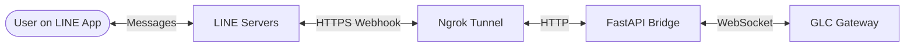

# Live Connection Setup & Testing Guide

This document explains what was implemented to support a live LINE messaging connection and provides instructions for testing the integration end-to-end with the main app.

## Architecture Note
The integration relies on a standalone bridge application (`bridge.py`) which acts as an intermediary. It receives inbound HTTPS webhooks directly from the LINE messaging platform, then forwards those events to the main GLC gateway via a persistent WebSocket connection. In a local testing environment, `ngrok` is used to expose the bridge's local port to the public internet so that LINE can reach it.



## What Was Done

1. **LINE Webhook Bridge:** Implemented a FastAPI application (`glc/channels/catalogue/line/bridge.py`) that acts as a webhook receiver for LINE events on the `/webhooks/line` endpoint.
2. **WebSocket Integration:** The bridge connects to the main GLC gateway via WebSockets (`ws://localhost:8111/v1/channels/line`) to forward incoming messages and receive agent replies.
3. **Tunneling Tooling (Ngrok):** Added `ngrok.tgz` to locally expose the webhook port to the internet.
4. **Organized Tests:** Added bridge testing logic into `tests/channels/test_line_bridge_ws.py`.

## How to Test Live in Combination With the App

To run a live test, you need an active LINE Developer account with a Messaging API channel created.

### 1. Configure Environment Variables
To get your LINE credentials:
1. Go to your [LINE Developers Console](https://developers.line.biz/console/).
2. Select your provider and your Messaging API channel.
3. Under the **Basic settings** tab, scroll down to find your **Channel secret** (`LINE_CHANNEL_SECRET`).
4. Under the **Messaging API** tab, scroll down to find your **Channel access token (long-lived)**. If it's not issued yet, click **Issue** (`LINE_CHANNEL_ACCESS_TOKEN`).

In your `.env` file, ensure the following LINE credentials are set:
```env
LINE_CHANNEL_ACCESS_TOKEN="your_line_channel_access_token_here"
LINE_CHANNEL_SECRET="your_line_channel_secret_here"
```

### 2. Start the Main App (Gateway)
Start your main GLC gateway application which will listen for websocket connections on port `8111` (or whichever port is defined).

### 3. Start the LINE Bridge
Run the FastAPI bridge application on an available port (e.g., `8000`):
```bash
uvicorn glc.channels.catalogue.line.bridge:app --port 8000
```
*Note: Make sure your Python virtual environment is activated and `uvicorn` is installed.*

### 4. Expose the Bridge to the Internet
Extract the `ngrok` binary (if not already extracted) and run it to tunnel HTTP traffic to your bridge application:
```bash
tar -xzf ngrok.tgz
./ngrok http 8000
```
Ngrok will display a forwarding URL that looks like `https://<random-id>.ngrok.app`.

### 5. Configure the LINE Webhook
1. Go to your [LINE Developers Console](https://developers.line.biz/console/).
2. Select your provider and your Messaging API channel.
3. In the **Messaging API** tab, scroll down to the **Webhook settings**.
4. Set the **Webhook URL** to your ngrok URL with the `/webhooks/line` path:
   `https://<random-id>.ngrok.app/webhooks/line`
5. Enable **Use webhook**.
6. Click **Verify** to ensure LINE can reach your bridge. You should see a success message.

### 6. Test the Bot
Send a message to your LINE bot from the LINE application on your phone or desktop. 
The event will traverse the following path:
`LINE App -> LINE Servers -> Ngrok -> Bridge (FastAPI) -> Gateway (WebSocket) -> GLC App`
The reply will flow back through the exact same path to your device.

> [!NOTE]
> **First-Time Setup (Allowed Senders):** 
> The first time you send a message, the application might drop it because your user ID is not yet in the `allowed_senders` list. 
> Check the bridge application logs for an error message indicating the message was dropped. This log will include your unique user ID.
> Copy that user ID and add it to the `allowed_senders` list under `defaults:` in your `glc/channels.yaml` file (or `~/.glc/channels.yaml`). 
> Once added, send another message to successfully communicate with the bot.
