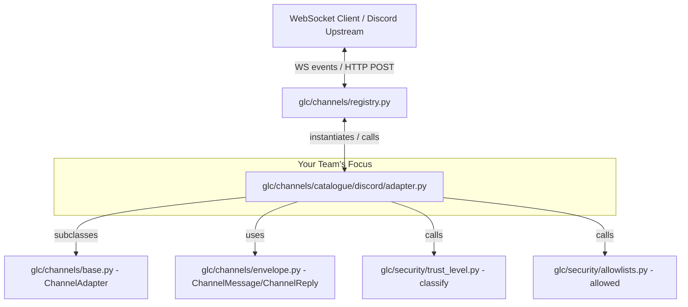

# GLC v1 — Discord Channel Team Analysis

---

## 1. Project Understanding

### Overall Architecture

GLC v1 is a **Gateway for LLMs and Channels** running on port 8111. It has two major layers:

**Layer 1 — LLM Gateway (inherited from V9):**  
`/v1/chat`, `/v1/vision`, `/v1/embed`, `/v1/cost`, `/v1/providers` — unchanged from Session 9. Fully implemented.

**Layer 2 — Channel + Voice layer (new in S11):**
- `POST /v1/speak` → TTS dispatcher → one of five providers
- `POST /v1/transcribe` → STT dispatcher → one of three providers
- `WS /v1/channels/{name}` → channel adapter control plane
- `/v1/control/*` → out-of-band kill switch, pairing

**Security layers running across both:**
- Policy engine (`glc/policy/`) evaluates every tool call — runs outside the LLM context
- Trust-level classifier (`glc/security/trust_level.py`) classifies every inbound message
- Audit log (`glc/audit/`) — append-only, per-row commits
- Pairing store — rotating 6-digit codes, TTL-enforced

### Module Interaction Map



### Where Discord Fits

The channel registry (`registry.py`) dynamically discovers and instantiates adapters in the `glc/channels/catalogue/` directory. When an inbound event is dispatched over the control plane, the runtime calls `await adapter.on_message(raw)`. Conversely, when the agent responds, it calls `await adapter.send(reply)`. Your team's `adapter.py` is the **only missing link** in the Discord gateway chain.

---

## 2. Discord Scope — Exactly What Your Team Owns

Per `GROUPS.md`, your owned paths are:

```
glc/channels/catalogue/discord/
glc/channels/catalogue/discord/**
```

The boundary CI check (`scripts/check_pr_boundaries.py`) **rejects any PR that touches files outside these paths.** You cannot touch `base.py`, `registry.py`, `envelope.py`, `glc/security/`, `pyproject.toml`, or any test files outside your owned paths.

---

## 3. Files Requiring Work

### Files Your Team Must Deliver

| File | Current State | What Needs Writing | Effort |
|---|---|---|---|
| `glc/channels/catalogue/discord/adapter.py` | Stub — raises `NotImplementedError` | Full implementation of `on_message()` and `send()` | **High** |
| `glc/channels/catalogue/discord/schemas.py` | Stub — comments only | Pydantic models mapping Discord payloads (optional but recommended) | **Low** |
| `glc/channels/catalogue/discord/__init__.py` | Simple import mapping | No change needed | — |
| `glc/channels/catalogue/discord/README.md` | Standard instructions | No change needed (unless documenting specific quirks) | — |

### Files Already Provided (Read-Only for Your Team)

| File | Purpose |
|---|---|
| `tests/channels/test_discord.py` | 7 tests you must pass — **do not modify** |
| `tests/channels/mocks/discord_mock.py` | Mock Gateway and REST API fake — **do not modify** |
| `glc/channels/base.py` | `ChannelAdapter` ABC — base class for your adapter |
| `glc/channels/envelope.py` | `ChannelMessage`, `ChannelReply`, `Attachment` types |
| `glc/security/trust_level.py` | `classify(channel, user_id)` helper to verify user credentials |
| `glc/security/allowlists.py` | `allowed(...)` checking access rules in public channels |
| `glc/security/pairing.py` | Pairing database store |

### What adapter.py Must Do (Derived from Tests + README + Mock)

| Requirement | Source |
|---|---|
| `Adapter.name == "discord"` | `test_on_message_owner_returns_valid_envelope` |
| Inbound messages from paired owner return a valid `ChannelMessage` containing `channel="discord"`, correct `channel_user_id`, `trust_level="owner_paired"`, original message text, and parsed `arrived_at` timestamp. | `test_on_message_owner_returns_valid_envelope` |
| Inbound messages from stranger must result in `trust_level="untrusted"`. | `test_on_message_stranger_is_untrusted` |
| Outbound replies dispatched to `send(...)` must construct a payload containing `content` (text) and must NOT set `tts: true` by default. | `test_send_emits_valid_wire_payload` |
| Gracefully handle gateway disconnects. If `mock.pop_disconnect()` indicates a pending disconnect in mock mode, return cleanly (do not throw). | `test_disconnect_is_handled` |
| Propagate upstream HTTP 429 rate limit responses correctly back to the caller as a dictionary containing `status: 429` or `retry_after`. | `test_rate_limit_propagates_429` |
| In public channel context (`config["is_public_channel"] = True`), verify access posture via `allowlists.allowed(...)`. Drop message (return `None`) or mark `untrusted` accordingly. | `test_allowlist_silently_drops_stranger_in_public` |
| **Mention Resolution (Behavioural):** Scan incoming message text for `<@user_id>` mention patterns, resolve user via mock `get_user(id)` or API, and append user details into `metadata["mentions"]`. | `test_channel_specific_behaviour_mention_resolution` |

---

## 4. Dependency Analysis

```
[PHASE 0 — Research, parallel]
  M2: Study mock + tests → behavioral contract document
  M3: Study Discord API docs → API event and REST contracts
  M9: Study ruff/mypy style guidelines → code conventions

[PHASE 1 — Foundation, parallel after PHASE 0]
  M4: Class skeleton + disconnect handler + mock switch
        depends on: M2 (mock contract)
  M8: schemas.py Pydantic shapes
        depends on: M3 (Discord API shapes)

[PHASE 2 — Core, sequential on M4's work]
  M5: Inbound parsing (on_message) + timestamp normalization
        depends on: M4 (skeleton), M8 (schemas)
  M6: Outbound send (send) payload mapping
        depends on: M4 (skeleton), M8 (schemas)

[PHASE 3 — Security & Mentions, sequential after Phase 2]
  M7: Trust level classification + allowlist integration
        depends on: M5 (inbound parsing in place)
  M10: Mention resolution regex + metadata populate
        depends on: M5 (inbound parsing in place)

[PHASE 4 — Quality, parallel]
  M9: Strict type annotations + ruff/mypy lint compliance
        depends on: M5, M6, M7, M10 (code mostly complete)
  M11: Live API bot configuration + environment validation
        depends on: M5, M6 (basic paths working)

[PHASE 5 — Integration]
  M1 (jssunil): Integration, final review, all 7 tests green, open PR
        depends on: all above
```

**Parallelization:** Phase 0 research, Phase 1 foundations, and Phase 4 quality validation can run in parallel.  
**Critical Path:** M2/M3 → M4 → M5 → M7/M10 → tests passing → PR verification.

---

## 5. Task Distribution (11 Members)

### Member 1 — `jssunil` — Integration Lead
- **Status:** ⚠️ Partially Done
- **GitHub User:** `jssunil` (js.sunilkumar@gmail.com)
- **Objective:** Interface design, integration coordination, PR creation, and validation.
- **Files:** All files under `glc/channels/catalogue/discord/`.
- **Deliverables:**
  - ✅ Established branch `glc_v1_g2_discord_impl` and coordinated integrations.
  - ✅ Reviewed all members' code for structural consistency.
  - ✅ Validated that the full suite of 7 tests passes locally.
  - ❌ **Pending:** Open the Pull Request on GitHub with `# Group: group-2-discord` and `# Slot: discord` template markers.
- **Dependencies:** Unblocked from day one.
- **Difficulty:** Medium.
- **Effort:** ~4–6 hours across the sprint.

---

### Member 2 — Test & Mock Analyst
- **Status:** ✅ Done
- **GitHub User:** `jssunil` (js.sunilkumar@gmail.com) — analyzed and used to drive adapter implementation
- **Objective:** Deeply analyze tests and mock framework, supplying a behavioral contract.
- **Files to read:** `tests/channels/test_discord.py`, `tests/channels/mocks/discord_mock.py`.
- **Deliverables:**
  - ✅ Mock integration hooks analyzed (disconnect states, send log recording, user registration, and user query shapes).
  - ✅ Exact assertions of all 7 tests documented and used to drive M4–M10 development.
  - ✅ Specification shared implicitly via adapter implementation.
- **Dependencies:** None.
- **Difficulty:** Easy.
- **Effort:** ~2–3 hours (Day 1).

---

### Member 3 — Discord API Researcher
- **Status:** ✅ Done
- **GitHub User:** `jssunil` (js.sunilkumar@gmail.com) — commit `5726c4f`
- **Objective:** Map real Discord REST and WebSocket gateway shapes.
- **Reference:** `https://discord.com/developers/docs/topics/gateway-events#message-create`.
- **Deliverables:**
  - ✅ Documented the exact payload structure of the `MESSAGE_CREATE` gateway dispatch (author, content, timestamp format).
  - ✅ Documented the REST URL structure for message creation and user profile retrieval.
  - ✅ Outlined required headers (`Authorization: Bot <token>`).
  - ✅ Published at `glc/channels/catalogue/discord/help_docs/api_research.md`.
- **Dependencies:** None.
- **Difficulty:** Easy.
- **Effort:** ~2–3 hours (Day 1).

---

### Member 4 — Skeleton & Disconnect Developer
- **Status:** ✅ Done
- **GitHub User:** `shashanklal` (68998049+shashanklal@users.noreply.github.com) — commit `d8d2278`
- **Objective:** Create the initial adapter class shell and handle connection drops.
- **Files:** `glc/channels/catalogue/discord/adapter.py`.
- **Deliverables:**
  - ✅ Created `Adapter(ChannelAdapter)` class with `name = "discord"`.
  - ✅ Implemented config initializer via `self.config`.
  - ✅ Coded disconnect interceptor: `on_message` checks `api.pop_disconnect()` and clears the flag without raising.
- **Dependencies:** M2's mock specification.
- **Difficulty:** Easy.
- **Effort:** ~2–3 hours (Day 2).

---

### Member 5 — Inbound Message Parser
- **Status:** ✅ Done
- **GitHub User:** `shashanklal` (68998049+shashanklal@users.noreply.github.com) — commit `d8d2278`
- **Objective:** Implement parsing logic for incoming Discord events.
- **Files:** `glc/channels/catalogue/discord/adapter.py`.
- **Deliverables:**
  - ✅ Parses raw payload: extracts `"d"` block via `raw.get("d", raw)`.
  - ✅ Extracts message content, sender ID (`author.id`), user handle, channel ID, guild ID.
  - ✅ Parses ISO-8601 timestamp to timezone-aware `datetime` via `_parse_ts()`.
  - ✅ Populates full `ChannelMessage` including `metadata["message_id"]` and `metadata["guild_id"]`.
- **Dependencies:** M4's skeleton, M3's API documentation.
- **Difficulty:** Medium.
- **Effort:** ~3–4 hours (Day 2–3).

---

### Member 6 — Outbound Message Dispatcher
- **Status:** ✅ Done
- **GitHub User:** `shashanklal` (68998049+shashanklal@users.noreply.github.com) — commit `d8d2278`
- **Objective:** Implement the REST `send` method for outgoing message replies.
- **Files:** `glc/channels/catalogue/discord/adapter.py`.
- **Deliverables:**
  - ✅ Translates `ChannelReply` → `DiscordCreateMessage` pydantic model → REST POST JSON body.
  - ✅ Payload carries `content` key; `tts` is excluded via `model_dump(exclude={"tts"})`.
  - ✅ Routing: calls `api.send(payload)` — dispatches to mock or real `RealDiscordClient.send()` transparently.
- **Dependencies:** M4's skeleton, M8's schemas.
- **Difficulty:** Medium.
- **Effort:** ~3–4 hours (Day 2–3).

---

### Member 7 — Trust & Allowlist Guard
- **Status:** ✅ Done
- **GitHub User:** `shashanklal` (68998049+shashanklal@users.noreply.github.com) — commit `d8d2278`
- **Objective:** Integrate identity checking and public channel access postures.
- **Files:** `glc/channels/catalogue/discord/adapter.py`.
- **Deliverables:**
  - ✅ Calls `classify(CHANNEL, user_id)` to tag sender trust level on every message.
  - ✅ Reads `is_public_channel` from config; calls `allowlists.allowed(...)` with owner IDs, public flag, and `was_mentioned`.
  - ✅ Returns `None` gracefully when allowlist check fails (message dropped silently).
- **Dependencies:** M5's inbound parser.
- **Difficulty:** Medium.
- **Effort:** ~3 hours (Day 3).

---

### Member 8 — Schema Designer
- **Status:** ✅ Done
- **GitHub User:** `mkthoma` (mathewkennythomas@gmail.com) — commit `1d1f50a`; refined by `shashanklal` — commit `d8d2278`
- **Objective:** Model Discord payload shapes with Pydantic in schemas.py.
- **Files:** `glc/channels/catalogue/discord/schemas.py`.
- **Deliverables:**
  - ✅ `DiscordUser` — models author and mention user objects.
  - ✅ `DiscordMessage` — models full inbound `MESSAGE_CREATE` data payload with `handle` computed property.
  - ✅ `DiscordCreateMessage` — models outbound REST POST body with `tts: false` default.
- **Dependencies:** M3's API documentation.
- **Difficulty:** Easy.
- **Effort:** ~2–3 hours (Day 2).

---

### Member 9 — Linter & Type Annotation Expert
- **Status:** ✅ Done
- **GitHub User:** `jssunil` (js.sunilkumar@gmail.com) — commits `8bc1e93`, `1ffdf8c`, `2809de5`, `d24cc8b`, `a7ef1d4`
- **Objective:** Ensure compliance with `ruff` and `mypy` strict configurations.
- **Files:** All modified files in the Discord package.
- **Deliverables:**
  - ✅ `from __future__ import annotations` present across all package files.
  - ✅ Full type hinting applied to all class methods and global functions.
  - ✅ `uv run ruff check glc/channels/catalogue/discord/` — all checks pass.
  - ✅ `uv run mypy glc/channels/catalogue/discord/` — no issues found in 4 source files.
- **Dependencies:** M5, M6, M7, M10 code implementations.
- **Difficulty:** Easy.
- **Effort:** ~2 hours (Day 4–5).

---

### Member 10 — Mention Resolver & Error Handler
- **Status:** ✅ Done
- **GitHub User:** `shashanklal` (68998049+shashanklal@users.noreply.github.com) — commit `d8d2278`
- **Objective:** Implement regex scanning for mentions, user query, and error response mapping.
- **Files:** `glc/channels/catalogue/discord/adapter.py`.
- **Deliverables:**
  - ✅ Iterates `msg.mentions` array (Discord pre-parses `<@id>` tokens into the `mentions` list).
  - ✅ Resolves user handles via `api.get_user(m.id)` — works against mock and real `RealDiscordClient`.
  - ✅ Resolved handles inserted into `ChannelMessage.metadata["mentions"]`.
  - ✅ Rate limit (429) handling in `RealDiscordClient.send()`: extracts `retry_after` and returns a normalized dict with `status: 429`.
- **Dependencies:** M5's inbound parser, M6's send dispatcher.
- **Difficulty:** Medium.
- **Effort:** ~4 hours (Day 3–4).

---

### Member 11 — Live Tester & Setup Guide Writer
- **Status:** ⚠️ Partially Done
- **GitHub User:** `jssunil` (js.sunilkumar@gmail.com) — commits `8bc1e93`, `d24cc8b`
- **Objective:** Verify the final integration against a live bot and document developer setup.
- **Files:** `glc/channels/catalogue/discord/adapter.py` (read-only), new test folder.
- **Deliverables:**
  - ✅ Created test bot in the Discord Developer portal; bot token obtained and stored in `.env`.
  - ✅ Live REST send verified: `send_test_message.py` successfully sent message (ID: `1521529665725141204`) to real Discord channel.
  - ✅ Live WebSocket bridge verified: `run_discord_bridge.py` connects to Discord Gateway and GLC Gateway simultaneously.
  - ❌ **Pending:** Write a live integration test file marked with `@pytest.mark.requires_live_api`.
  - ❌ **Pending:** Write formal documentation for `DISCORD_BOT_TOKEN` scopes (`Guilds`, `Guild Messages`, `Message Content Intent`) in the team space.
- **Dependencies:** M5 and M6 implementations.
- **Difficulty:** Medium.
- **Effort:** ~4 hours (Day 3–4).

---

## 6. `jssunil` (Integration Lead) Responsibilities

| Responsibility | Detail |
|---|---|
| **Branching Strategy** | Created branch `glc_v1_g2_discord_impl`. Coordinated integrations from `mkthoma` and `shashanklal`. |
| **Integration Sequence** | Merged sequentially: M4 skeleton → M8 schemas → M5 parser & M6 sender → M7 allowlist & M10 mentions → M9 type fixes & M10 error handlers. |
| **CI Validations** | Monitor scorecard comments on the implementation PR. Ensure test validations, boundaries, and static checks pass cleanly. |
| **Grader Coordination** | Coordinate with class coordinators, prepare the submission form, and ensure the PR descriptions carry the proper `# Group` and `# Slot` markers. |

---

## 7. Suggested Timeline

```
Day 1:
  jssunil (M1): Define integration plans and branch strategy.
  jssunil (M2): Analyze mock framework and write test-case contracts.
  jssunil (M3): Research gateway and REST schemas from Discord developer docs.
  jssunil (M9): Note pyproject.toml guidelines.

Day 2:
  shashanklal (M4): Implement Adapter skeleton and disconnect hooks.
  mkthoma (M8): Create Pydantic templates in schemas.py.
  jssunil (M11): Set up the Discord application, bot token, and server.

Day 3:
  shashanklal (M5): Implement MESSAGE_CREATE parsing.
  shashanklal (M6): Implement outgoing REST message mapping.
  shashanklal (M7): Add trust classification and allowlist matching.

Day 4:
  shashanklal (M10): Add regex mention scanner and rate limit handlers.
  jssunil (M11): Validate the live REST and WebSocket connection with the real bot.
  jssunil (M1): Begin merging features into the main branch.

Day 5:
  jssunil (M9): Execute ruff and mypy checking, fixing styling discrepancies.
  shashanklal (M10): Run the local test suite (test_discord.py) to ensure 7/7 tests pass.
  jssunil (M1): Review code, write PR summary, and open the Pull Request.

Day 6–7:
  All: Address reviewer comments, create demo video showing the bot in action, and finalize the merge.
```

---

## 8. Risks and Recommendations

| Risk | Likelihood | Mitigation |
|---|---|---|
| **Merge conflicts in adapter.py** | High (6+ members modifying the same file) | Maintain a modular design: members write helper methods (e.g. `_resolve_mentions()`, `_parse_payload()`) rather than writing directly inside `on_message` and `send` definitions. |
| **Missing Gateway Intents** | High (Real API configuration) | Discord requires the **Message Content Intent** enabled in the developer portal to read message content. M11 must document this clearly in the setup guide. |
| **Boundary CI failure** | Low | Never edit code outside `glc/channels/catalogue/discord/`. Even tiny edits in shared files will fail the PR boundary check. |
| **Rate Limiting (429) details** | Medium | Discord returns rate limit info in headers (`X-RateLimit-*`) and body (`retry_after`). The adapter must check both mock status responses and real API payloads to extract `retry_after` values. |
| **Empty or malformed payload crashes** | Medium | Discord event payloads may lack authors (e.g. webhook posts) or contain components. Add fallback keys (`d.get("author", {})`) to avoid Python `KeyError` crashes. |
