Step 1: Create a Discord Application and Bot

  1. Go to the Discord Developer Portal: https://discord.com/developers/applications
     
     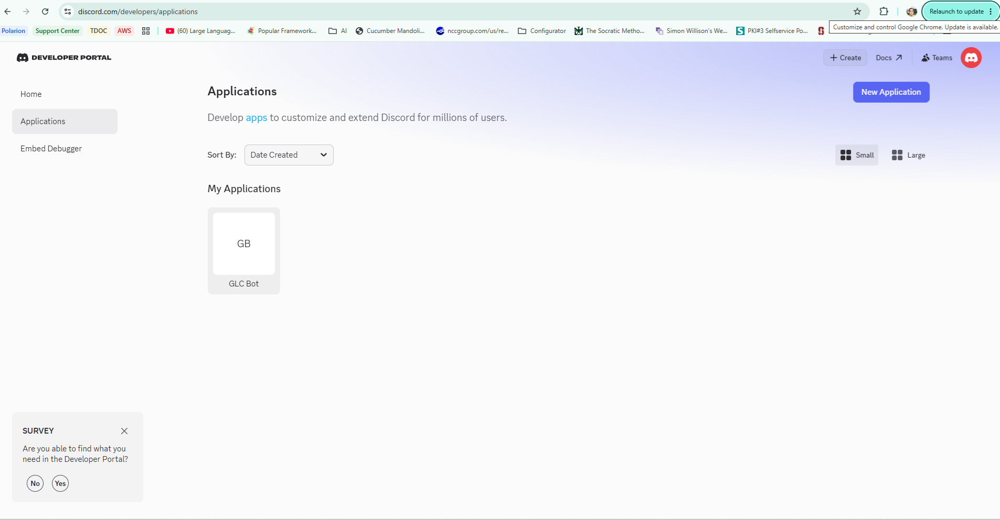

  2. Click New Application, name it (e.g., GLC Bot), click Create.
     
     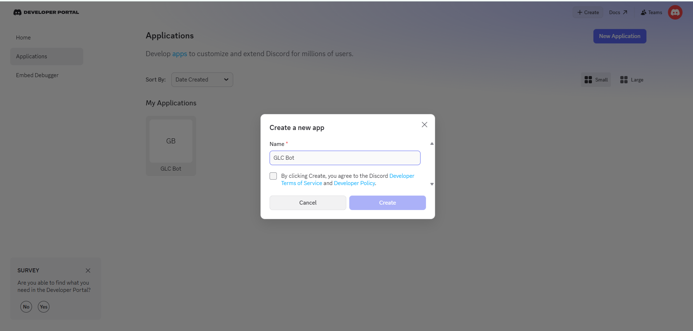

  3. In the left sidebar, click Bot.
     
     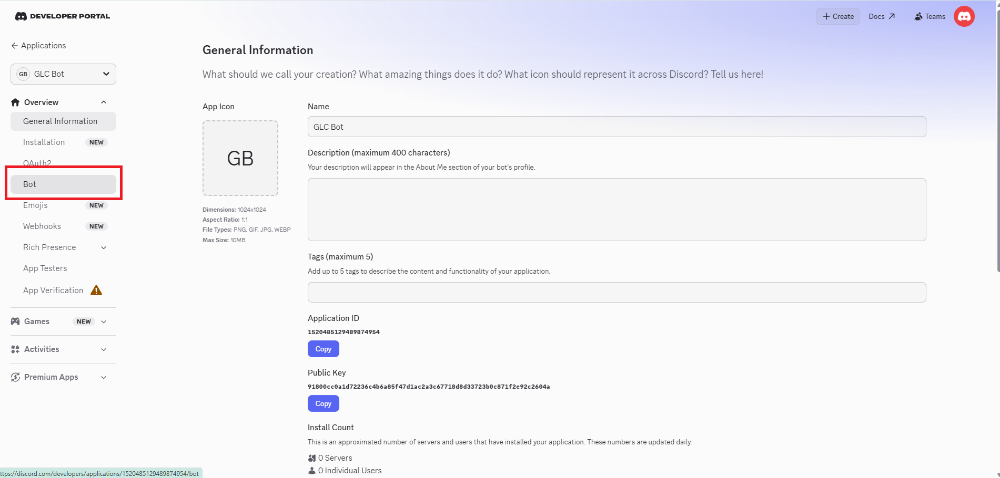

  4. Click Add Bot → confirm. This creates the bot user.
     
     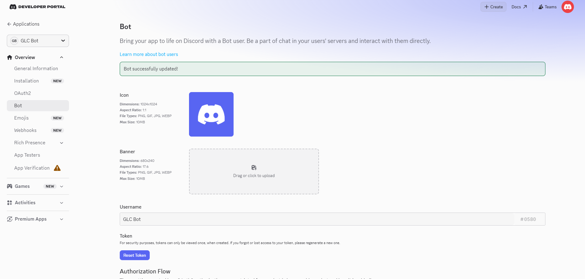
     
     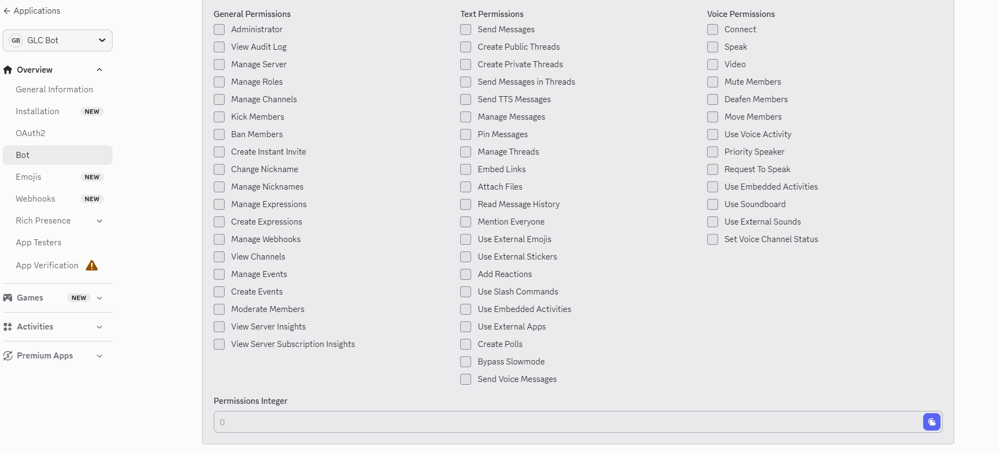

  5. Under Token, click Reset Token → copy the token — this is your DISCORD_BOT_TOKEN. Store it securely; you only see it once.
     
     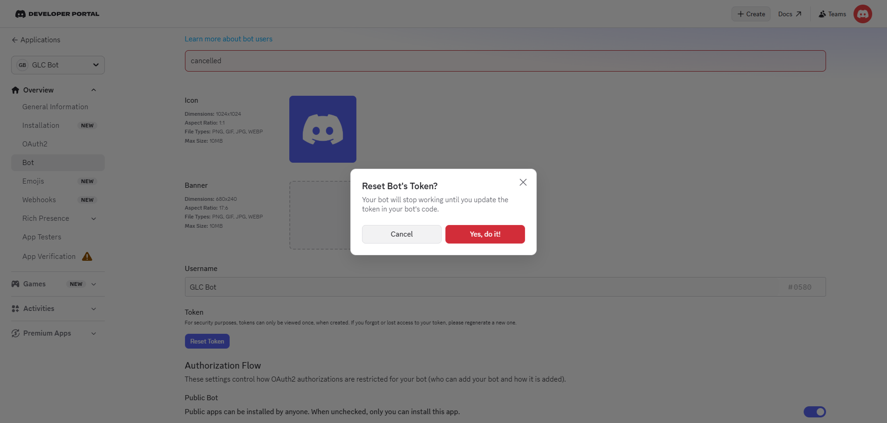
     
     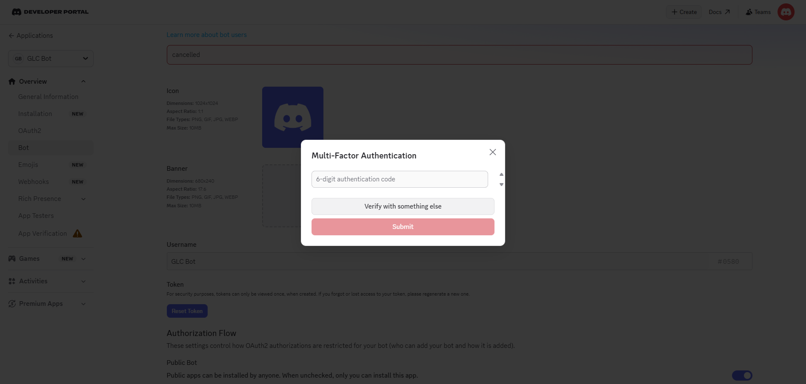
     
     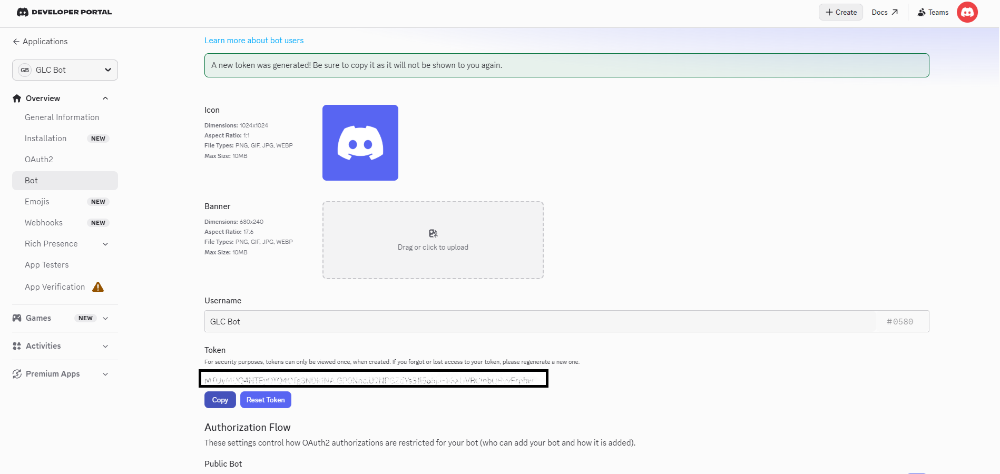

  6. Under Privileged Gateway Intents, enable:
    - Message Content Intent (required to read message text)
    - Server Members Intent (needed for user resolution)
    
    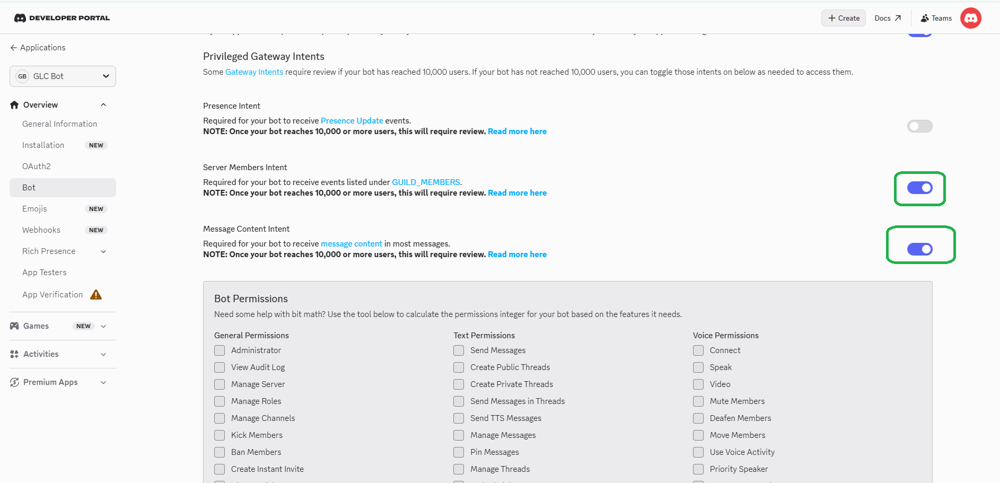

  7. Click Save Changes.

  ---
  Step 2: Invite the Bot to Your Server

  1. In the Developer Portal, go to OAuth2 → URL Generator.
  2. Under Scopes, select bot.
  3. Under Bot Permissions, select at minimum:
    - Read Messages/View Channels
    - Send Messages
    - Read Message History
  4. Copy the generated URL, open it in a browser, and select your server.
     
     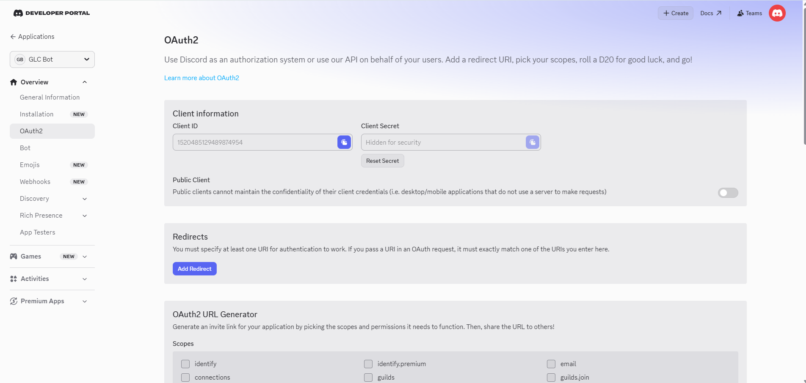
     
     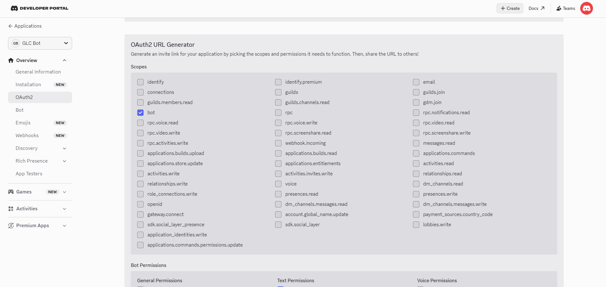
     
     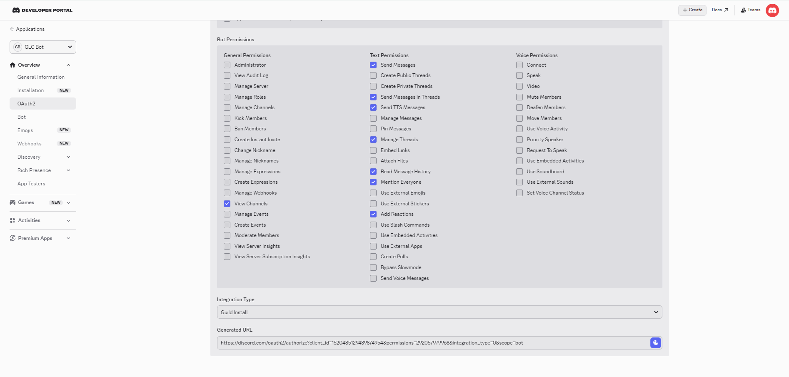
     
     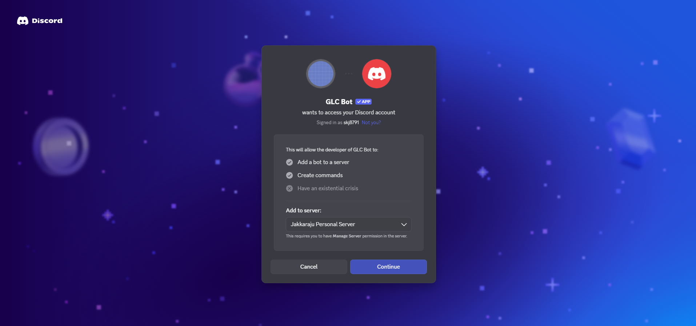

https://discord.com/oauth2/authorize?client_id=1520485129489874954&permissions=292057979968&integration_type=0&scope=bot

  ---
  Step 3: Set the Environment Variable

  $env:DISCORD_BOT_TOKEN = "your-token-here"

  For persistence, add it to your .env file or system environment variables. The adapter reads it via:

  import os
  token = os.environ["DISCORD_BOT_TOKEN"]

  ---
  Step 4: How the Adapter Uses It

  In this project, the adapter at glc/channels/catalogue/discord/adapter.py uses a mock in tests (injected via config["mock"]). For real Discord, it would use the token to:

  - Receive: Connect to the Discord Gateway WebSocket (wss://gateway.discord.gg) and listen for MESSAGE_CREATE dispatch frames (op: 0, t: "MESSAGE_CREATE").
  - Send: POST to https://discord.com/api/v10/channels/{channel_id}/messages with Authorization: Bot {DISCORD_BOT_TOKEN} and body {"content": "..."}.

  The wire format the adapter must parse is exactly what the mock produces (from discord_mock.py):

  {
    "op": 0, "t": "MESSAGE_CREATE", "s": 1,
    "d": {
      "id": "<msg_id>",
      "channel_id": "444555666",
      "guild_id": "111222333",
      "author": {"id": "<user_id>", "username": "...", ...},
      "content": "hello",
      "mentions": [...],   # list of User objects for <@id> tags
      ...
    }
  }

  ---
  Step 5: Get Channel and Guild IDs (for real use)

  You need the channel ID to send messages. In Discord:

  1. Enable Developer Mode: User Settings → Advanced → Developer Mode.
  2. Right-click any channel → Copy Channel ID → this is your channel_id for the REST send endpoint.
  3. Right-click the server name → Copy Server ID → this is guild_id.

  ---
  Summary of credentials needed

  ┌───────────────────┬───────────────────────────────────────────────────────┐
  │     Variable      │                    Where to get it                    │
  ├───────────────────┼───────────────────────────────────────────────────────┤
  │ DISCORD_BOT_TOKEN │ Developer Portal → Bot → Reset Token                  │
  ├───────────────────┼───────────────────────────────────────────────────────┤
  │ channel_id        │ Discord client (Developer Mode) → right-click channel │
  ├───────────────────┼───────────────────────────────────────────────────────┤
  │ guild_id          │ Discord client → right-click server name              │
  └───────────────────┴───────────────────────────────────────────────────────┘

  The only required env var for this project is DISCORD_BOT_TOKEN. The channel_id and guild_id are embedded in inbound gateway events, so the adapter extracts them from raw["d"]["channel_id"] rather than configuring them
  separately.