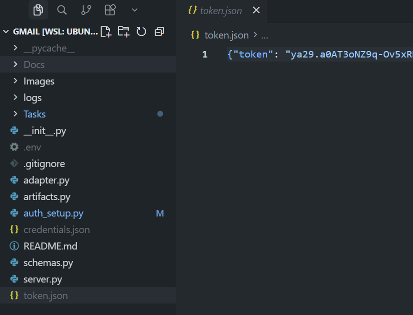
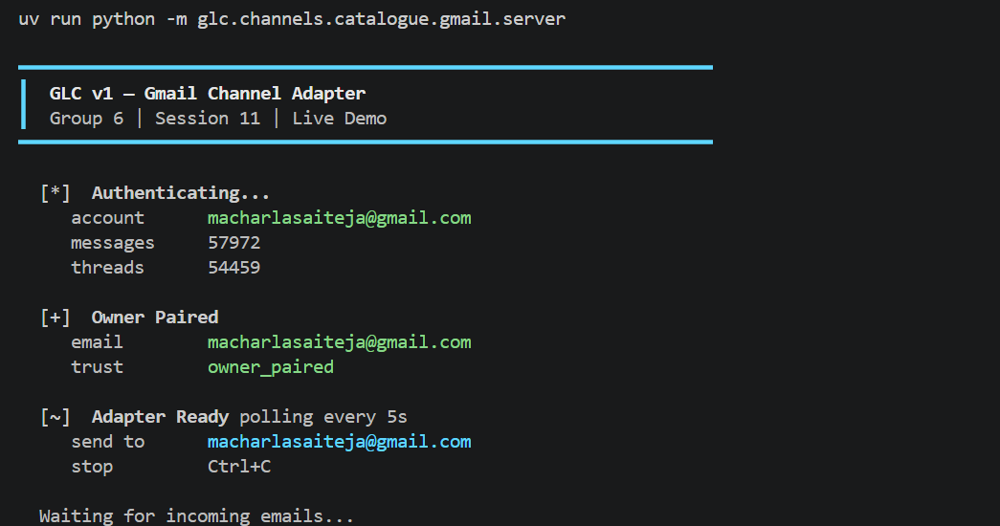
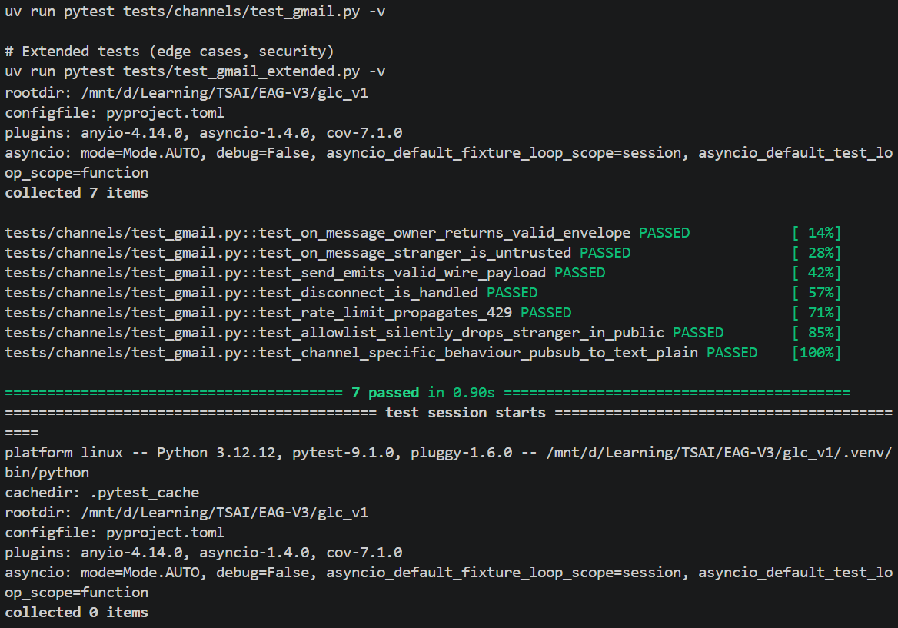
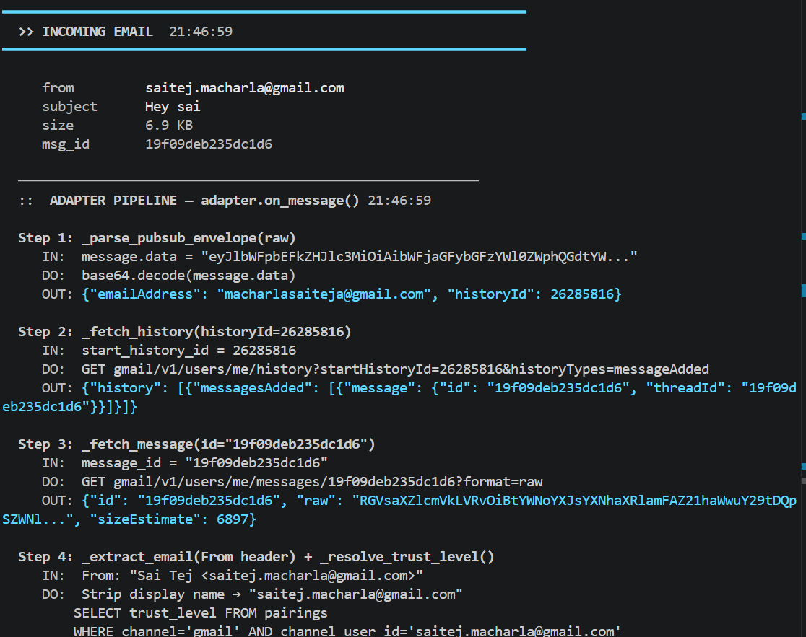
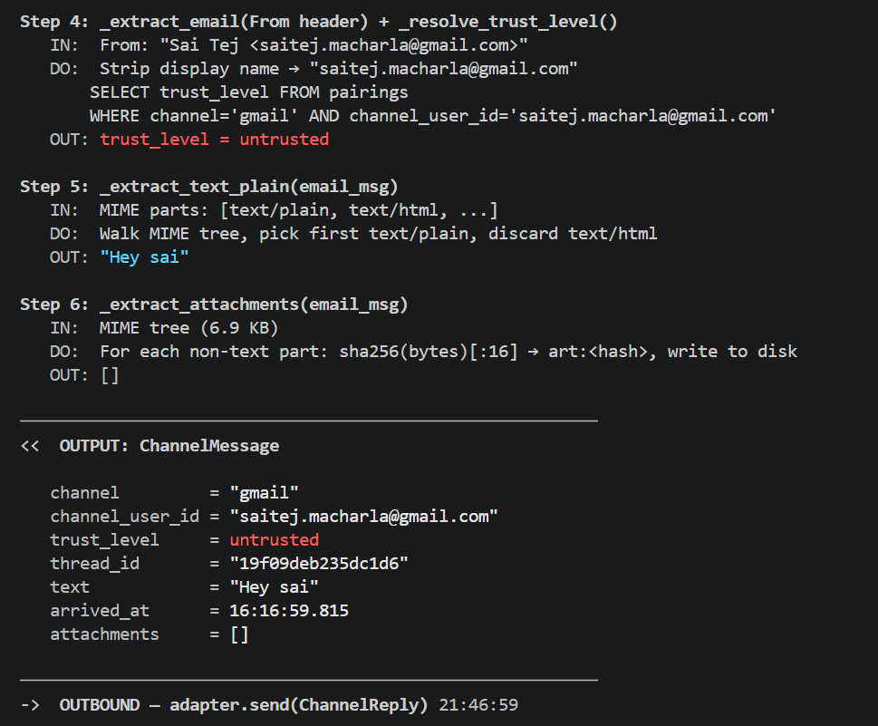
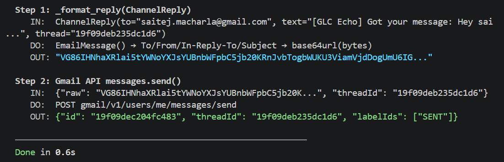
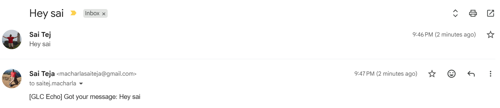
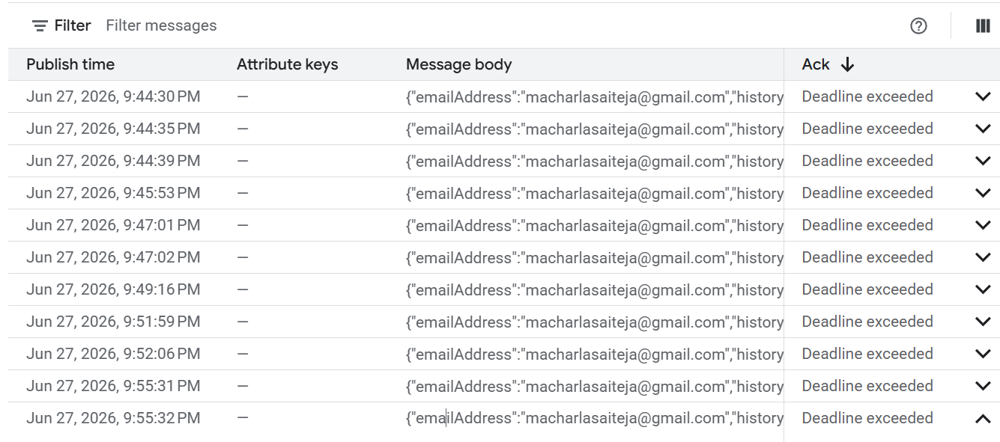

# Gmail Channel Adapter — Group 6

Gmail Pub/Sub push adapter for GLC v1. Translates Gmail's wire format into typed `ChannelMessage`/`ChannelReply` envelopes that GLC's agent runtime understands.

## File Structure

```
glc/channels/catalogue/gmail/
├── adapter.py          # Main adapter — on_message() and send()
├── artifacts.py        # Ephemeral artifact store for attachments
├── auth_setup.py       # One-time OAuth setup + Gmail watch registration
├── server.py           # Live demo server (polls Gmail, logs pipeline)
├── schemas.py          # Gmail wire-format Pydantic types (Pub/Sub, API payloads)
├── __init__.py
├── .gitignore          # Blocks credentials/tokens from git
├── credentials.json    # OAuth client credentials (NOT committed)
└── token.json          # OAuth refresh token (NOT committed)
```

## Architecture

```
                         Pub/Sub push
                              │
                              ▼
┌─────────────────────────────────────────────────────┐
│  adapter.on_message(raw)                            │
│                                                     │
│  1. _parse_pubsub_envelope  → decode base64 JSON    │
│  2. _fetch_history          → get new message IDs   │
│  3. _fetch_message          → fetch raw RFC 822     │
│  4. _resolve_trust_level    → classify sender       │
│     ↳ DROP if untrusted + public channel mode       │
│  5. _extract_text_plain     → text/plain only       │
│  6. _extract_attachments    → art:<hash> refs       │
│                                                     │
│  Output: ChannelMessage(trust, text, attachments)   │
└─────────────────────────────────────────────────────┘
                              │
                              ▼
                    GLC Gateway / Agent
                              │
                              ▼
┌─────────────────────────────────────────────────────┐
│  adapter.send(ChannelReply)                         │
│                                                     │
│  1. _format_reply   → RFC 2822 MIME, base64url      │
│  2. Gmail API       → messages.send({raw, threadId})│
│                                                     │
└─────────────────────────────────────────────────────┘
```

## How to Replicate

### Prerequisites

- Python 3.11+
- A Gmail account for the bot (e.g. `eagv3.s11@gmail.com`)
- A Google Cloud project with Gmail API + Pub/Sub enabled

### Step 1: Clone and install

```bash
git clone https://github.com/Shwethaamrutha/glc_v1.git
cd glc_v1
git checkout feat/gmail-adapter
uv sync
```

### Step 2: Google Cloud setup

1. Go to [console.cloud.google.com](https://console.cloud.google.com)
2. Create a project (or use existing)
3. Enable **Gmail API** and **Cloud Pub/Sub API**
4. Create a **Pub/Sub topic** named `gmail-notifications`
5. Grant publish permission to `gmail-api-push@system.gserviceaccount.com` (role: Pub/Sub Publisher)
6. Create **OAuth 2.0 credentials** (Desktop app type)
7. Configure OAuth consent screen:
   - User type: External
   - Add your bot email as a test user
   - Scope: `https://www.googleapis.com/auth/gmail.modify`
8. Download the credentials JSON → save as `glc/channels/catalogue/gmail/credentials.json`

### Step 3: Authenticate

```bash
uv run python -m glc.channels.catalogue.gmail.auth_setup
```

This opens a browser for OAuth consent. After approval:
- `token.json` is saved (persistent refresh token)
- `gmail.users.watch()` is called to register Pub/Sub notifications



### Step 4: Run the live server

```bash
export GLC_GMAIL_OWNER="your-personal-email@gmail.com"
uv run python -m glc.channels.catalogue.gmail.server
```

The server polls Gmail every 5 seconds. Send an email from your personal account to the bot account to see the full pipeline logged. The `GLC_GMAIL_OWNER` email will get `owner_paired` trust level.



### Step 5: Run tests

```bash
# Required 7 tests (must pass for CI)
uv run pytest tests/channels/test_gmail.py -v

# Extended tests (edge cases, security)
uv run pytest tests/test_gmail_extended.py -v
```

All 7 CI-required tests pass:



## Live Demo

End-to-end run against a real Gmail account, captured from the live server.

### 1. Inbound email arrives

A real email (`subject: "Hey sai"`) hits the bot inbox and the adapter logs each pipeline step — `_parse_pubsub_envelope` → `_fetch_history` → `_fetch_message` → `_extract_email` + `_resolve_trust_level`:



### 2. Body extraction and ChannelMessage output

`_extract_text_plain` surfaces only the `text/plain` part (discarding `text/html`), `_extract_attachments` returns `[]`, and the adapter emits the typed `ChannelMessage` (an unknown sender resolves to `trust_level = untrusted`):



### 3. Outbound reply

`_format_reply` builds the RFC 2822 MIME (base64url), then `messages.send({raw, threadId})` posts the echo reply back into the same thread:



### 4. Reply lands in Gmail

The `[GLC Echo]` reply appears in the Gmail thread:



### 5. Pub/Sub notifications

The Gmail `users.watch()` registration publishes `{emailAddress, historyId}` notifications to the Pub/Sub topic:



## Pipeline Details

### Inbound: Email → ChannelMessage

| Step | Method | What it does |
|------|--------|-------------|
| 1 | `_parse_pubsub_envelope()` | Decode base64 Pub/Sub data → `{emailAddress, historyId}` |
| 2 | `_fetch_history()` | Call `users.history.list` → discover new message IDs |
| 3 | `_fetch_message()` | Call `users.messages.get(format=raw)` → RFC 822 bytes |
| 4 | `_resolve_trust_level()` | Extract `From:` header, lookup in pairing store |
| 5 | `_extract_text_plain()` | Walk MIME tree, extract text/plain, discard HTML |
| 6 | `_extract_attachments()` | Walk MIME tree, hash non-text parts → `art:<sha>` refs |

### Outbound: ChannelReply → Email

| Step | Method | What it does |
|------|--------|-------------|
| 1 | `_format_reply()` | Build RFC 2822 MIME (To, From, In-Reply-To, body) → base64url |
| 2 | Gmail API `messages.send()` | POST `{raw, threadId}` |

### Trust Levels

| Level | Who | What the policy engine allows |
|-------|-----|-------------------------------|
| `owner_paired` | The bot owner (registered in pairing store) | All tools and actions |
| `user_paired` | Explicitly paired contacts | Read-only tools |
| `untrusted` | Everyone else | Policy-restricted, minimal actions |

Trust is resolved from `~/.glc/pairings.sqlite`. The owner is registered on server startup via:
```python
store.force_pair_owner("gmail", "owner@gmail.com", user_handle="owner")
```

Or configure via environment variable:
```bash
export GLC_GMAIL_OWNER="your-email@gmail.com"
```

### Artifact Store

Attachments are stored ephemerally at `~/.glc/artifacts/<sha256[:16]>`:
- Written when an attachment is extracted
- Cleaned up after the agent finishes processing
- Auto-expires after 5 minutes (failsafe via `cleanup_expired()`)
- Path traversal protected (refs validated as 16-char hex only)

## Environment Variables

| Variable | Default | Purpose |
|----------|---------|---------|
| `GMAIL_OAUTH_CLIENT_ID` | (none — required for live) | OAuth 2.0 client id used for the token refresh exchange |
| `GMAIL_OAUTH_CLIENT_SECRET` | (none — required for live) | OAuth 2.0 client secret (never committed; read from env) |
| `GMAIL_PUBSUB_TOPIC` | `projects/<project>/topics/gmail-notifications` | Fully-qualified Pub/Sub topic for `users.watch()` |
| `GLC_GMAIL_OWNER` | (none — required) | Owner email for trust pairing |
| `GMAIL_BOT_ADDRESS` | `me` | From address in outbound emails |
| `GLC_ARTIFACTS_DIR` | `~/.glc/artifacts` | Attachment storage directory |
| `GLC_PAIRING_DB` | `~/.glc/pairings.sqlite` | Trust pairing database path |

See `.env.example` for a copy-paste template. `.env` is gitignored — never commit real secrets.

## Wire Format Quirks

1. **Pub/Sub push carries only a historyId**, not the email body. The adapter must make 2 additional API calls (history.list → messages.get) to get the actual content.
2. **Gmail's `raw` field uses base64url without padding** — the adapter adds padding before decoding.
3. **Multipart MIME**: Most emails have both text/plain and text/html. The adapter always picks text/plain to avoid injecting HTML/scripts into agent context.
4. **Display names in From header**: Gmail returns `"Name <email>"` format. The adapter strips to bare email before trust lookup.
5. **Thread continuity**: Replies include `In-Reply-To` and `References` headers + `threadId` in the API payload so replies appear in the same Gmail thread.

## Tests

### CI Required (7 tests) — `tests/channels/test_gmail.py`

1. `test_on_message_owner_returns_valid_envelope` — owner trust
2. `test_on_message_stranger_is_untrusted` — unknown sender
3. `test_send_emits_valid_wire_payload` — outbound RFC 822 format
4. `test_disconnect_is_handled` — graceful disconnect handling
5. `test_rate_limit_propagates_429` — 429 passed to caller
6. `test_allowlist_silently_drops_stranger_in_public` — public channel gate
7. `test_channel_specific_behaviour_pubsub_to_text_plain` — full Pub/Sub → text pipeline

### Extended (15 tests) — `tests/test_gmail_extended.py`

- Malformed Pub/Sub envelopes (3 tests)
- HTML-only email handling
- Unicode preservation
- Empty body handling
- Display name stripping for trust
- PDF and multiple attachment extraction
- Thread ID propagation in replies
- Artifact store security (path traversal)
- Artifact store lifecycle (store → get → remove)
- Reply header verification (In-Reply-To, References)

