# US-1 — Real-world wiring: Meta WhatsApp Cloud API

**Story ID:** US-1  
**Output:** Test phone number · access token · app secret · verified webhook subscription  
**Exit criteria:** No code commit required — hand the `.env` values listed at the end to the US-13 (demo) and US-14 (README) owners.  
**Acceptance bar:** One real WhatsApp message round-trips: phone sends → webhook fires → manual reply lands on phone.

---

## Overview

US-1 has **two distinct phases**:

| Phase | What you do | What you produce |
|---|---|---|
| A — Account setup | Create Meta app, get test number, tokens, app secret | Credentials for `.env` |
| B — Webhook wiring | Run tunnel + minimal server, verify in Meta console, send test message | Confirmed working subscription |

Phase A can be done entirely in a browser. Phase B needs your laptop running.

---

## Pre-requisites

- A Facebook / Meta account (personal or work — does not matter; no business verification is needed)
- Python 3.11 installed (the repo's own interpreter)
- `uv` installed (`pip install uv` or the official installer)
- `ngrok` **or** `cloudflared` installed — pick one:
  - ngrok: download from [ngrok.com/download](https://ngrok.com/download), unzip, put on PATH
  - cloudflared: `winget install Cloudflare.cloudflared` on Windows, or `brew install cloudflare/cloudflare/cloudflared` on macOS
- A WhatsApp account on a real phone — needed to receive the test message and open the 24-hour window

---

## Phase A — Meta Developer account and app setup

> Steps below reflect the **current wizard-based UI** as navigated on 23 Jun 2026.
> Screenshot filenames match files in `help_docs/screenshots/`.

---

### Step 1 — Fill in App details

Go to **[developers.facebook.com](https://developers.facebook.com)** → **My Apps** → **Create App**.

The wizard opens at **App details**:
- **App name:** `eag-glc-wa-test` (any name ≤ 30 chars works)
- **App contact email:** your email address
- Click **Next**.

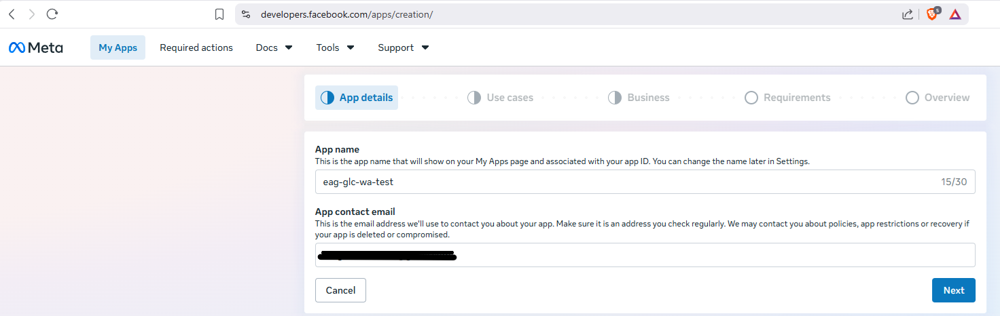

---

### Step 2 — Select the WhatsApp use case

The wizard moves to **Use cases**. You see ~19 use cases across categories.

1. Filter by **"Business messaging"** on the left, or scroll to the bottom of the Featured list.
2. Check **"Connect with customers through WhatsApp"** — a blue tick appears and "1 use case added" shows at the bottom.
3. Click **Next**.

> Note: some use cases are greyed out and say "can't be combined on the same app" once WhatsApp is selected. That's expected.

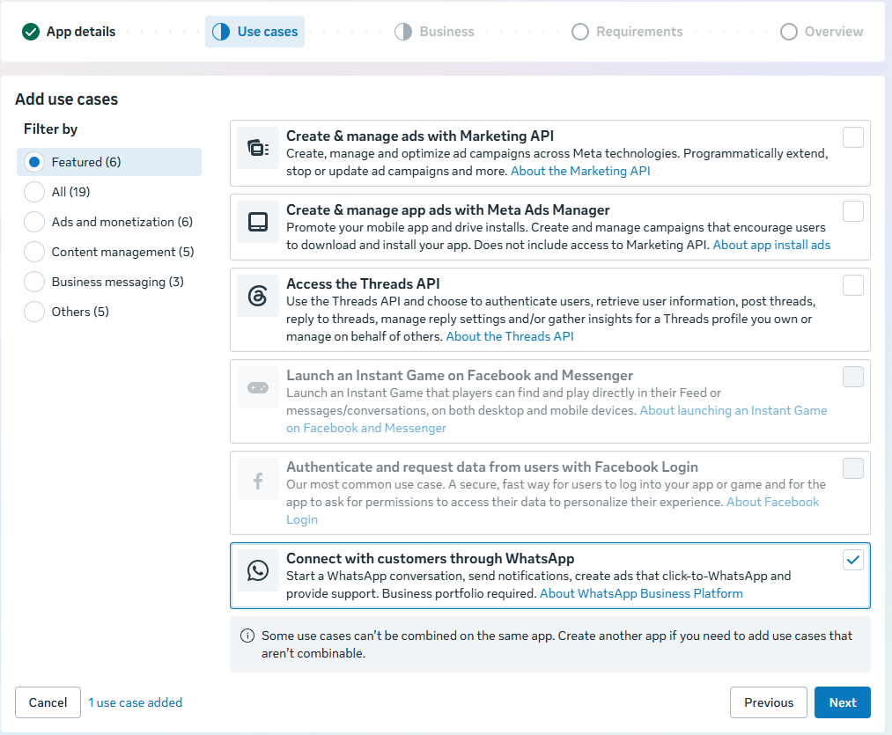

---

### Step 3 — Create and attach a Business Portfolio

The wizard moves to **Business**. The new Meta UI requires a Business Portfolio even for test apps — you will see a yellow warning: **"No businesses available."**

1. Click the **"create a new one"** link inside the warning box. A new tab opens at `business.facebook.com`.
2. Fill in: Business name (`RaghuGlctest` or any name), your name, your email. Click **Submit**.
3. A modal appears: **"RaghuGlctest was created"** with two buttons.
4. Click **"Verify later"** — verification is not needed for test access.
5. Close the modal (×). Switch back to the app creation tab.
6. The Business step now shows `RaghuGlctest` in the dropdown. Select it → click **Next**.

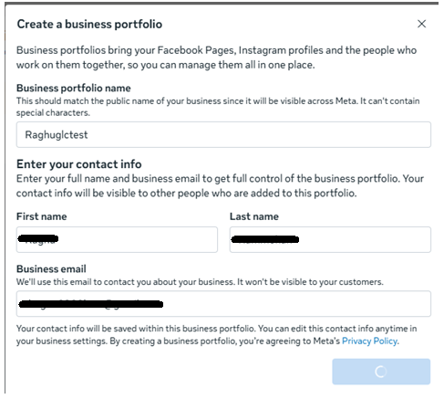

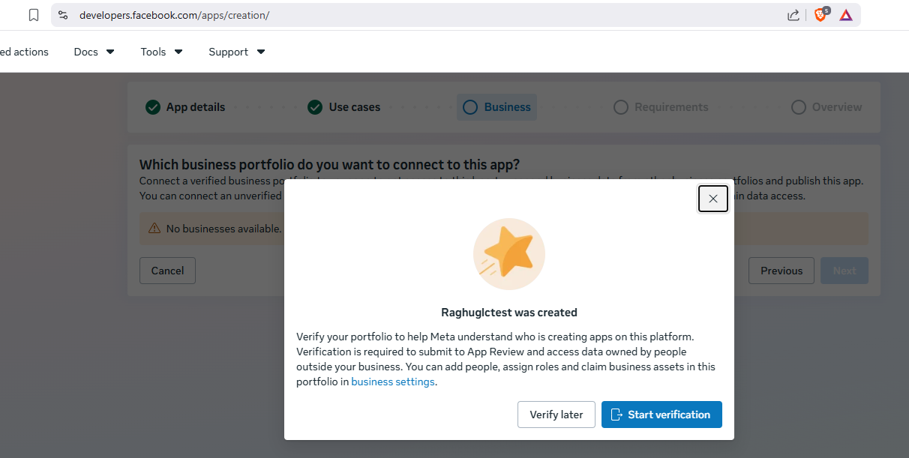

> **Why unverified is fine:** Full verification is only required for App Review and production access. The test WABA and test phone number work without it.

---

### Step 4 — Requirements and Overview → Create app

- **Requirements** step: shows "No requirements for the use cases on this app." Nothing to do — click **Next**.
- **Overview** step: confirms App name (`eag-glc-wa-test`), Use case (WhatsApp), Business (`RaghuGlctest`, Unverified), Requirements (none).
- Click **"Create app"**.

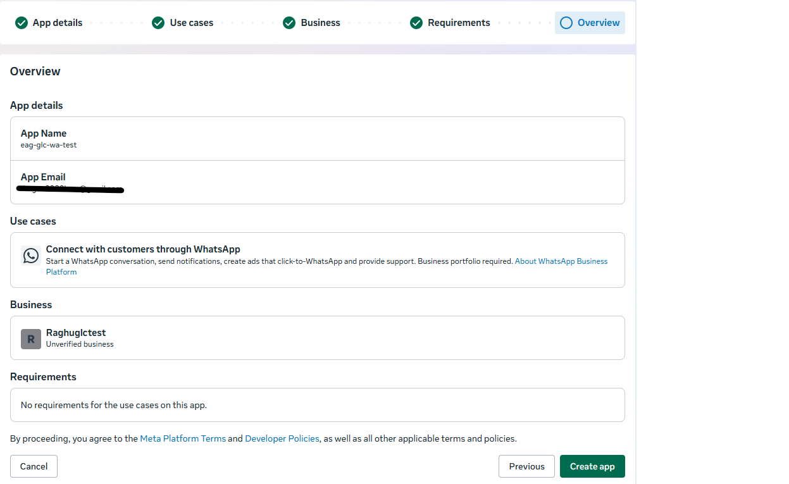

---

### Step 5 — Navigate to the WhatsApp setup panel

After creation you land on the **Dashboard**. There is no "Add a Product" button in the new UI.

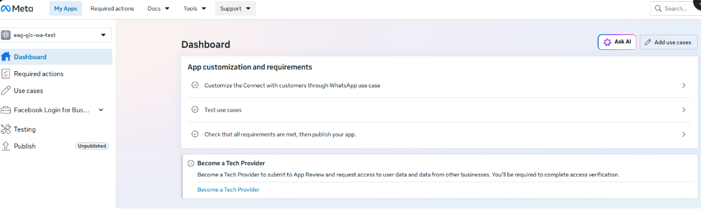

1. In the left sidebar, click **"Use cases"** — this lists the WhatsApp use case you selected.
2. Click **"Customize"** next to it.

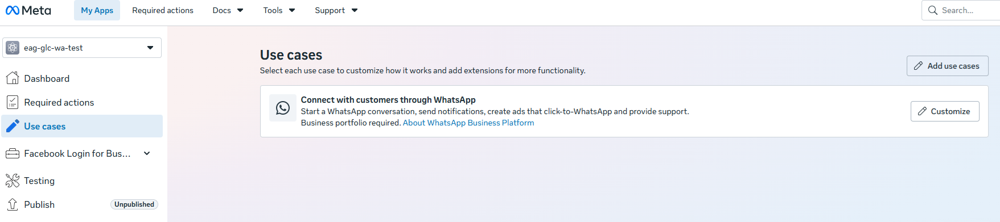

A panel slides in on the right: **"WhatsApp Business Platform"** with `RaghuGlctest` pre-selected and the terms of service shown. Click **"Continue"**.

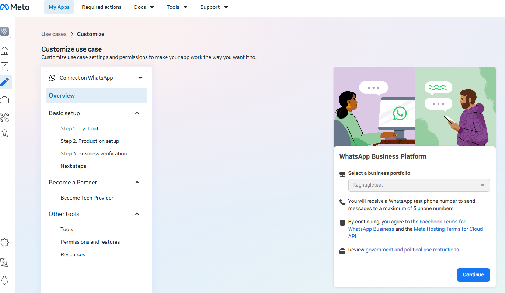

---

### Step 6 — Choose integration type

After clicking Continue, you land on the **Overview** page inside Use cases → Customize.

- Click **"Integrate with API"** (already selected by default).
- The left sidebar now shows **Step 1. Try it out**, **Step 2. Production setup**, **Step 3. Business verification**.
- **Ignore Steps 2 and 3** — those are for going live with a real business number. We only need Step 1.

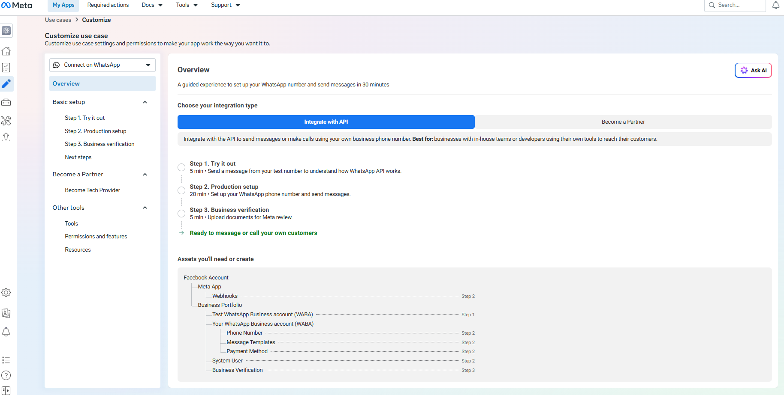

---

### Step 7 — Grant account access (OAuth dialog)

Clicking into Step 1 triggers an OAuth dialog: **"Choose the WhatsApp accounts you want eag-glc-wa-test to access."**

- Keep **"Opt in to current WhatsApp accounts only"** selected (default).
- The **Test WhatsApp Business Account** checkbox is pre-ticked — "1 asset selected".
- Click **"Continue"**.

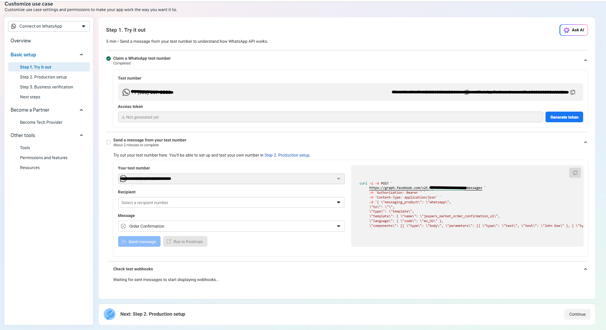

---

### Step 8 — Collect credentials from "Step 1. Try it out"

You land on the **Step 1. Try it out** panel — the equivalent of the old "API Setup / Getting Started" page.

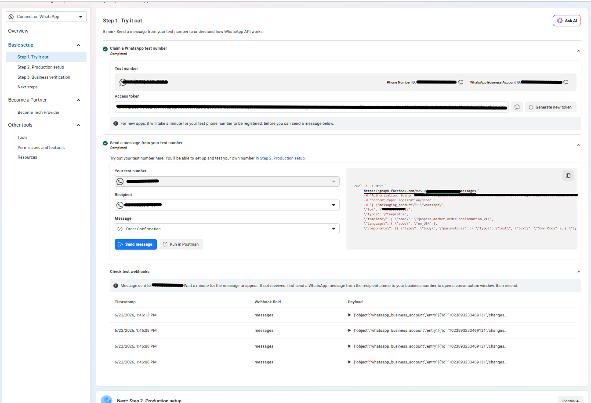

**Copy the Phone Number ID:**
Under **"Claim a WhatsApp test number"** (shown as Completed ✅), find the **Phone Number ID** field next to your test number. Click its copy icon. This is `WHATSAPP_PHONE_NUMBER_ID`.

**Generate and copy the Access token:**
The **Access token** field is shown just below the phone number. Click **"Generate new token"** → copy the full token. This is your temporary `WHATSAPP_TOKEN` (expires in 24 hours — you'll replace it with a permanent one in Step 10).

**Send the template message:**
Under **"Send a message from your test number"** (also shown Completed ✅):
1. Your test number is pre-filled in **"Your test number"**.
2. Add your personal WhatsApp number in **"Recipient"** (E.164 format, no `+`, e.g. `&lt;your-personal-number&gt;`).
3. Leave **Message** as the default template (`Order Confirmation` or `hello_world`).
4. Click **"Send message"**.

Check your phone — the template message should arrive within seconds.

**Reply from your phone** with anything ("hi", "test") to the test number. This switches the conversation to user-initiated mode and opens the **24-hour free-form messaging window** required for the US-13 demo.

> **"Check test webhooks" table:** The timestamp/payload table at the bottom of this panel is Meta's own internal webhook log for the test environment — separate from the GLC webhook you'll configure in Phase B. Seeing events there confirms Meta is receiving your messages, but your server isn't involved yet.

---

### Step 9 — Retrieve the App Secret

1. In the left sidebar → **App settings → Basic**.
2. Scroll to **App secret** → click **Show** → enter your Facebook password if prompted.
3. Copy the value immediately. This is `WHATSAPP_APP_SECRET`.

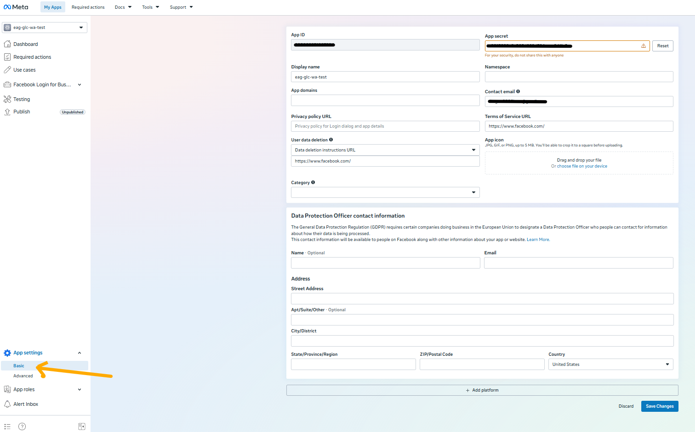

It requires your password every time you view it, so save it now.

---

### Step 10 — Get a 60-day token via Graph API Explorer *(optional)*

> **Optional — but recommended.** The 24-hour token from Step 8 is sufficient for Phase B today. If you skip this step, regenerate the token from the "Step 1. Try it out" panel before the US-13 demo (10 seconds). Come back here if you want a longer-lived token to avoid daily regeneration.

The token from Step 8 expires in 24 hours. Use the Graph API Explorer to get a 60-day token — no Facebook Page or Business Suite access required.

**Use the Graph API Explorer:**

1. Go to **[developers.facebook.com/tools/explorer](https://developers.facebook.com/tools/explorer)**.
2. Set:
   - **Meta App:** `eag-glc-wa-test`
   - **User or Page:** `User Token`
   - **Permissions:** add `whatsapp_business_management` + `whatsapp_business_messaging` (2 options selected)
3. Click **"Generate Access Token"** — accept the permissions popup that appears.
4. Copy the short-lived token from the Access Token field.

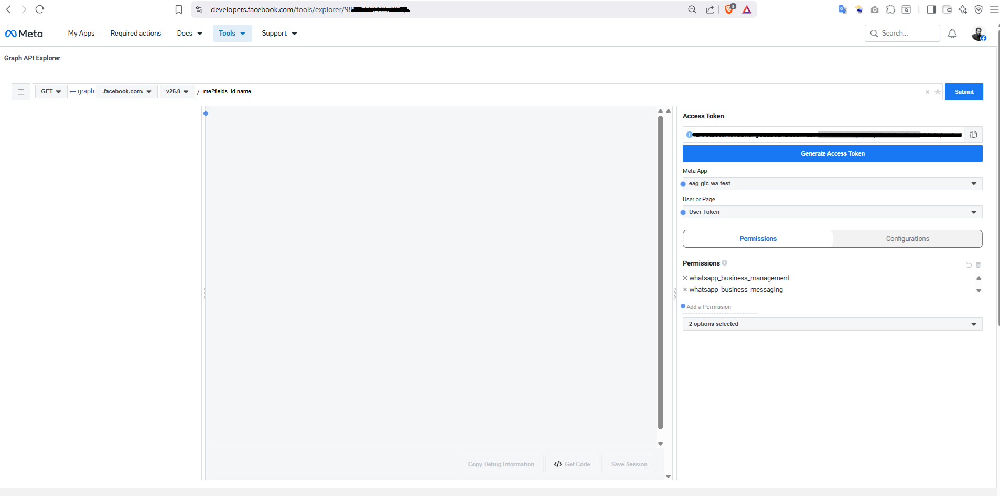

**Exchange for a 60-day token:**

Run this Python one-liner from the repo root (works on any OS):

```bash
uv run python -c "
import json, urllib.request, urllib.parse
params = urllib.parse.urlencode({
    'grant_type': 'fb_exchange_token',
    'client_id': 'YOUR_APP_ID',
    'client_secret': 'YOUR_APP_SECRET',
    'fb_exchange_token': 'YOUR_SHORT_LIVED_TOKEN',
})
with urllib.request.urlopen(f'https://graph.facebook.com/v20.0/oauth/access_token?{params}') as r:
    print(json.loads(r.read())['access_token'])
"
```

- `YOUR_APP_ID` = visible in App settings → Basic (also in the Graph API Explorer URL)
- `YOUR_APP_SECRET` = `WHATSAPP_APP_SECRET` from Step 9
- `YOUR_SHORT_LIVED_TOKEN` = the token copied from the Access Token field in the Explorer

A successful exchange prints a long token string starting with `EAANZC...`.

Copy the printed token and update `WHATSAPP_TOKEN` in `.env`.

> **Regenerating after expiry:** repeat Step 10 only. No need to redo Steps 1–9.

---

## Phase B — Tunnel, webhook server, verification

### Step 11 — Start the minimal webhook server

The GLC main server (port 8111) doesn't yet have an HTTP webhook route — that comes in US-9. For US-1, you run a minimal standalone script that:
- Responds to Meta's `hub.challenge` GET request (webhook verification)
- Logs inbound POST payloads to the console so you can see messages arrive

Create this file (it's a temporary dev tool, not committed):

**`glc/channels/catalogue/whatsapp/help_docs/US1_meta_wiring/scripts/meta_webhook_test_server.py`**:

```python
"""Minimal Meta webhook verification + logging server for US-1.

Run with: uv run python glc/channels/catalogue/whatsapp/help_docs/US1_meta_wiring/scripts/meta_webhook_test_server.py
Listens on port 8765 by default (different from the main GLC server).
"""

import hashlib
import hmac
import json
import os
from http.server import BaseHTTPRequestHandler, HTTPServer
from urllib.parse import parse_qs, urlparse

VERIFY_TOKEN = os.environ.get("WHATSAPP_VERIFY_TOKEN", "glc-verify-token-us1")
APP_SECRET   = os.environ.get("WHATSAPP_APP_SECRET", "")
PORT = int(os.environ.get("WEBHOOK_PORT", "8765"))


def _verify_signature(body: bytes, sig_header: str) -> bool:
    if not APP_SECRET or not sig_header.startswith("sha256="):
        return False
    expected = "sha256=" + hmac.new(APP_SECRET.encode(), body, hashlib.sha256).hexdigest()
    return hmac.compare_digest(expected, sig_header)


class Handler(BaseHTTPRequestHandler):
    def do_GET(self):
        parsed = urlparse(self.path)
        params = parse_qs(parsed.query)
        mode      = (params.get("hub.mode")         or [""])[0]
        token     = (params.get("hub.verify_token") or [""])[0]
        challenge = (params.get("hub.challenge")    or [""])[0]

        if mode == "subscribe" and token == VERIFY_TOKEN:
            print(f"[webhook] ✅ Verification OK — challenge={challenge!r}")
            self.send_response(200)
            self.send_header("Content-Type", "text/plain")
            self.end_headers()
            self.wfile.write(challenge.encode())
        else:
            print(f"[webhook] ❌ Bad verify_token: got {token!r}, expected {VERIFY_TOKEN!r}")
            self.send_response(403)
            self.end_headers()

    def do_POST(self):
        length = int(self.headers.get("Content-Length", 0))
        body   = self.rfile.read(length)
        sig    = self.headers.get("X-Hub-Signature-256", "")

        if APP_SECRET and not _verify_signature(body, sig):
            print("[webhook] ⚠️  Signature mismatch — payload may be forged")
            self.send_response(403)
            self.end_headers()
            return

        try:
            data = json.loads(body)
            print("[webhook] ✅ Inbound payload:")
            print(json.dumps(data, indent=2))
        except Exception:
            print(f"[webhook] Raw body: {body!r}")

        self.send_response(200)
        self.send_header("Content-Type", "application/json")
        self.end_headers()
        self.wfile.write(b'{"status":"ok"}')

    def log_message(self, fmt, *args):  # silence default access log noise
        pass


if __name__ == "__main__":
    print(f"[webhook] Server listening on port {PORT}")
    print(f"[webhook] VERIFY_TOKEN = {VERIFY_TOKEN!r}")
    print(f"[webhook] APP_SECRET   = {'(set)' if APP_SECRET else '(not set — signature checks skipped)'}")
    HTTPServer(("", PORT), Handler).serve_forever()
```

Run it:
```bash
# From repo root, with .env already containing WHATSAPP_APP_SECRET:
uv run python glc/channels/catalogue/whatsapp/help_docs/US1_meta_wiring/scripts/meta_webhook_test_server.py
```

You should see:
```
[webhook] Server listening on port 8765
[webhook] VERIFY_TOKEN = 'glc-verify-token-us1'
[webhook] APP_SECRET   = (set)
```

Keep this terminal open.

### Step 12 — Start the tunnel

Open a second terminal. Pick one:

**Option A — ngrok:**
```bash
ngrok http 8765
```
ngrok prints a **Forwarding** line like:
```
Forwarding   https://abc123.ngrok-free.app -> http://localhost:8765
```
Copy the `https://` URL. This is your webhook base URL.

**Option B — cloudflared:**
```bash
cloudflared tunnel --url http://localhost:8765
```
cloudflared prints a URL like `https://some-name.trycloudflare.com`. Copy it.

> **Note:** Free ngrok URLs change each time ngrok restarts. Do not restart ngrok until you're done with this session, or you'll need to re-verify the webhook.

### Step 13 — Register the webhook in Meta console

1. In the Meta App Dashboard → **WhatsApp → Configuration** (left sidebar).
2. Under **Webhook**, click **Edit**.
3. Fill in:
   - **Callback URL:** `<your-tunnel-URL>/` (the full URL including trailing slash, e.g. `https://abc123.ngrok-free.app/`)
   - **Verify Token:** `glc-verify-token-us1` (must exactly match `WHATSAPP_VERIFY_TOKEN` in your server)
4. Click **Verify and Save**.

What happens:
- Meta sends a GET to your tunnel URL with `hub.mode=subscribe`, `hub.verify_token`, `hub.challenge`.
- Your server echoes `hub.challenge` with 200.
- Meta shows a green ✅ or confirms "Webhook verified successfully".

In your terminal you should see:
```
[webhook] ✅ Verification OK — challenge='123456789'
```

If you see the 403 path, double-check that `WHATSAPP_VERIFY_TOKEN` in the env matches what you typed in the Meta console.

### Step 14 — Subscribe WABA to the messages webhook field

Add two more values to your `.env` before running (the WABA ID is visible on the "Step 1. Try it out" panel as **WhatsApp Business Account ID**; the App ID is in App settings → Basic):

```bash
WHATSAPP_WABA_ID=<numeric WABA ID>
WHATSAPP_APP_ID=<numeric App ID>
```

Then run the helper script (already in `tmp/`, gitignored):

```bash
uv run python glc/channels/catalogue/whatsapp/help_docs/US1_meta_wiring/scripts/meta_waba_subscribe_and_roundtrip.py <your-personal-number>
```

What to expect for Step 14:
```
STEP 14 — Subscribe WABA to messages webhook field
Attempt 1 — user token (WHATSAPP_TOKEN)
  → POST https://graph.facebook.com/v20.0/<WABA_ID>/subscribed_apps
  ← 200 OK
{ "success": true }
✅ Step 14 done — WABA subscribed to app webhooks via user token
```

The script tries the 60-day user token first (requires `whatsapp_business_management` permission, granted in Step 10), then falls back to the app access token. Either succeeds here.

### Step 15 — Verify the round-trip

The same script continues immediately to Step 15 after Step 14 succeeds.

**Outbound leg** — the script POSTs a text message to your personal number:
```
STEP 15 — Outbound round-trip test
  → POST https://graph.facebook.com/v20.0/<PHONE_NUMBER_ID>/messages
  ← 200 OK
{
    "messaging_product": "whatsapp",
    "contacts": [{"input": "&lt;your-personal-number&gt;", "wa_id": "&lt;your-personal-number&gt;"}],
    "messages": [{"id": "wamid.HBgM..."}]
}
✅ Step 15 done — message sent
```

Check your phone — the message **"Round-trip confirmed from GLC US-1!"** should arrive within seconds.

**Inbound leg** — from your personal WhatsApp, send any reply to the test number. Watch the terminal running `meta_webhook_test_server.py`. You should see the full JSON payload:
```json
{
  "object": "whatsapp_business_account",
  "entry": [{
    "changes": [{
      "value": {
        "messages": [{"from": "&lt;your-personal-number&gt;", "text": {"body": "hello!"}, ...}]
      }
    }]
  }]
}
```

**Both legs working = US-1 acceptance criteria met.**

> **Common errors:**  
> `131047` — 24-hour window closed: send a message to the test number from your phone first.  
> `190` — token expired: regenerate from the Step 1 panel (Step 8) or re-run Step 10.

---

## Collecting your credentials

### Where does `.env` go?

At the **repo root** — `glc_v1_whatsapp/.env`. It is already covered by `.gitignore` (`.env` and `.env.*` are listed there).

```
glc_v1_whatsapp/     ← repo root — put .env HERE
├── .env             ← gitignored, never committed
├── .env.example     ← committed template
└── glc/
    └── main.py
```

Full path on this machine: `c:\Raghu\MyLearnings\EAG_V3\S11-20062026\assignment\glc_v1_whatsapp\.env`

### `.env` contents

The canonical template is `.env.example` at the repo root. Copy it to `.env` and fill in the Meta values now; Twilio values are filled by US-2.

```bash
# ---------------------------------------------------------------------------
# Meta WhatsApp Cloud API
# ---------------------------------------------------------------------------

# The numeric Phone Number ID shown on the "Step 1. Try it out" panel.
WHATSAPP_PHONE_NUMBER_ID=

# Access token for the Graph API.
#   24-hour token: generated via "Generate new token" on the Step 1 panel.
#   60-day token:  exchanged via Graph API Explorer (Step 10 of this guide).
WHATSAPP_TOKEN=

# App secret from App settings → Basic → App secret → Show.
WHATSAPP_APP_SECRET=

# Numeric App ID — visible in App settings → Basic, or in the Graph API Explorer URL.
WHATSAPP_APP_ID=

# WhatsApp Business Account ID — shown on the "Step 1. Try it out" panel.
WHATSAPP_WABA_ID=

# Arbitrary string — must match exactly what you enter in Meta console → Webhook → Verify Token.
WHATSAPP_VERIFY_TOKEN=glc-verify-token-us1

# ---------------------------------------------------------------------------
# Twilio WhatsApp Sandbox  — filled by US-2
# ---------------------------------------------------------------------------
TWILIO_ACCOUNT_SID=
TWILIO_AUTH_TOKEN=
TWILIO_WHATSAPP_FROM=
TWILIO_WEBHOOK_URL=
```

Never put real values in `.env.example`. Never commit `.env`.

---

## What to hand off

| Value | Variable name | Step where obtained | Who needs it |
|---|---|---|---|
| Phone Number ID | `WHATSAPP_PHONE_NUMBER_ID` | Step 8 | US-10, US-13, US-14 |
| Access token (60-day) | `WHATSAPP_TOKEN` | Step 10 | US-10, US-13, US-14 |
| App secret | `WHATSAPP_APP_SECRET` | Step 9 | US-3, US-9, US-14 |
| App ID | `WHATSAPP_APP_ID` | Step 9 (App settings → Basic) | US-14 |
| WABA ID | `WHATSAPP_WABA_ID` | Step 8 ("Step 1. Try it out" panel) | Step 14, US-14 |
| Verify token | `WHATSAPP_VERIFY_TOKEN` | Chosen by you (Step 13) | US-14 |
| Evidence of round-trip | terminal log / screenshot | Step 15 | US-13 (demo) |

Paste variable names and values into a **private** team channel (Slack DM, not the public repo).

---

## Common problems and fixes

| Symptom | Likely cause | Fix |
|---|---|---|
| `hub.challenge` never arrives | Tunnel not running or wrong port | Confirm `ngrok http 8765` is running; check the tunnel URL is reachable |
| Meta shows "Verification failed" | Verify token mismatch | Confirm `WHATSAPP_VERIFY_TOKEN` matches exactly what you typed in the Meta console |
| 403 on signature check | `WHATSAPP_APP_SECRET` not set in env | Set it before starting the server; restart the server |
| Send script returns 190 (invalid token) | 24-hour token expired | Regenerate temp token (Step 8) or re-run Step 10 for a 60-day token |
| Message sends but no reply arrives | 24-hour window closed | Reply from your phone first to reopen it; or use a template |
| ngrok says "ERR_NGROK_402" | Rate limit / unauthenticated | `ngrok config add-authtoken <your-token>` (free account sufficient) |
| Meta error `131047` on send | 24-hour window closed | User must message first; see §9 of HANDOFF.md |

---

## Checklist

**Phase A — completed 23 Jun 2026**
- [x] App `eag-glc-wa-test` created (wizard: App details → Use cases → Business → Overview)
- [x] Business portfolio `RaghuGlctest` created (unverified) and attached
- [x] WhatsApp use case selected; Test WABA provisioned via "Step 1. Try it out"
- [x] Template message delivered to personal phone
- [x] Personal phone replied — 24-hour free-form window open
- [x] Phone Number ID copied → `WHATSAPP_PHONE_NUMBER_ID`
- [x] Temporary access token generated → `WHATSAPP_TOKEN` (24-hour)
- [x] App secret retrieved from App settings → Basic → `WHATSAPP_APP_SECRET`
- [x] `.env` file populated with all four Meta variables
- [x] 60-day token generated via Graph API Explorer and exchanged — `WHATSAPP_TOKEN` updated in `.env` (Step 10)

**Phase B — completed 23 Jun 2026**
- [x] `glc/channels/catalogue/whatsapp/help_docs/US1_meta_wiring/scripts/meta_webhook_test_server.py` running on port 8765
- [x] Tunnel running (ngrok, India region)
- [x] Webhook registered and verified in Meta console — green tick (Step 13)
- [x] WABA subscribed to **messages** webhook field via `glc/channels/catalogue/whatsapp/help_docs/US1_meta_wiring/scripts/meta_waba_subscribe_and_roundtrip.py` (Step 14)
- [x] Outbound message `"Round-trip confirmed from GLC US-1!"` delivered to personal number — `wamid.<redacted>` (Step 15, outbound leg)
- [x] Inbound reply `"Confirmed"` received and logged by webhook server — sent/delivered/read status updates confirmed (Step 15, inbound leg)
- [x] Credential values shared privately with team (never committed)
