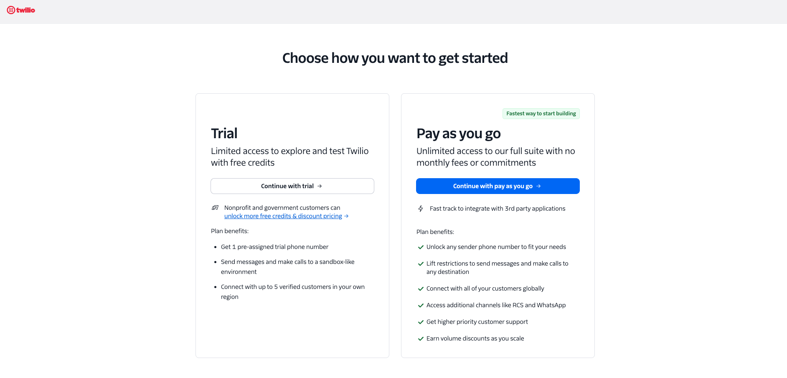
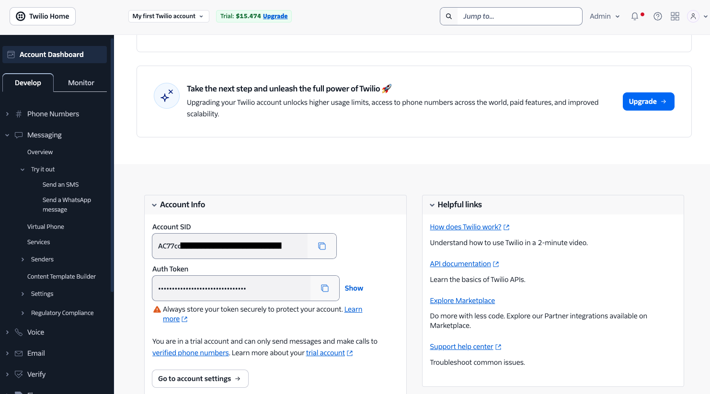
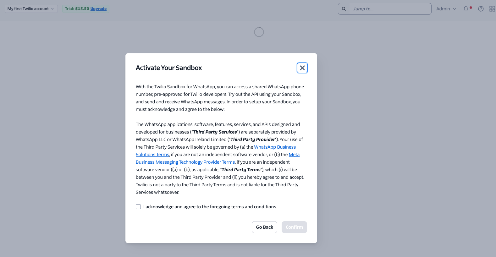
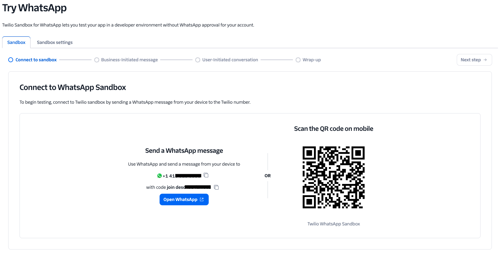
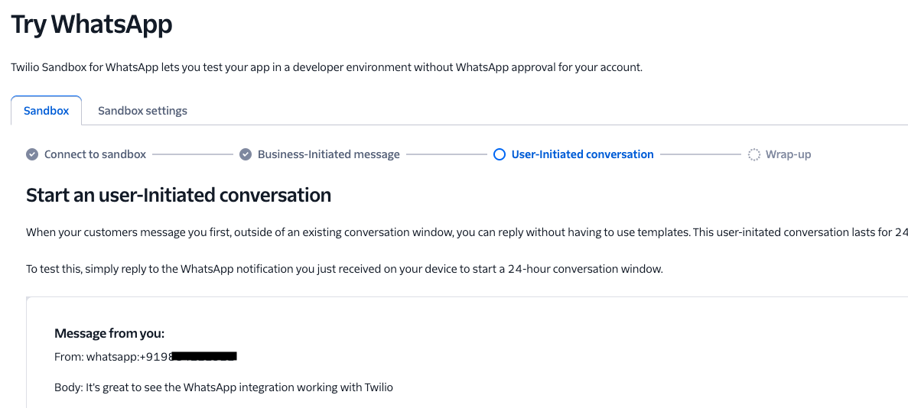

## Twilio website setup for WhatsApp Sandbox

### 1. Create or log in to Twilio

1. Go to [Twilio Console](https://console.twilio.com/).
2. Complete account signup and verify your email and phone number.
3. When prompted, choose **Continue with trial** — the free trial is sufficient for sandbox testing.



4. Once logged in, scroll down on the Account Dashboard to the **Account Info** section and note:
   - `Account SID`
   - `Auth Token` (click **Show** to reveal it)



These are the credentials you will later place in your local `.env`.

---

### 2. Open the WhatsApp Sandbox page

In the Twilio Console:

1. Open **Messaging** in the left sidebar.
2. Go to **Try it out**.
3. Click **Send a WhatsApp message**.

Twilio will show an **Activate Your Sandbox** modal with its terms of service.

4. Check **”I acknowledge and agree to the foregoing terms and conditions”** and click **Confirm**.



On this page, Twilio shows the **WhatsApp Sandbox** details, including:

- The sandbox WhatsApp number.
- Your account’s unique sandbox join code.
- A QR code that can prefill the join message.
- Sandbox settings for inbound webhook URLs.

---

### 3. Join the sandbox from your WhatsApp mobile app

After activating, you land on the **Connect to WhatsApp Sandbox** page showing the sandbox number and join code.



From your personal phone:

1. Open **WhatsApp**.
2. Start a chat with the sandbox number shown on screen.
3. Send the exact join message shown on the page:

```text
join <your sandbox code>
```

Example:

```text
join white-butterfly
```

Twilio should reply in WhatsApp confirming that your phone number has joined the sandbox.

**Alternative:** Scan the QR code shown on the page — WhatsApp will open with the join message prefilled. Send that message to complete the join.

---

### 4. Confirm sandbox is ready

After the join succeeds, confirm you now have all of these from the Twilio website:

- `Account SID`
- `Auth Token`
- Sandbox WhatsApp number
- Sandbox join code
- Sandbox settings page access

At least one end user must join the sandbox before Twilio can send or receive WhatsApp sandbox messages for that number.

---

### 5. Optional next step in Twilio Console

Still on the WhatsApp Sandbox page, open the **Sandbox Settings** tab and locate:

- **When a message comes in** — paste your tunnel URL here (e.g. ngrok or cloudflared endpoint)
- **Status callback URL** (optional, for delivery tracking)

This is where you configure the webhook URL so Twilio knows where to send inbound messages.

---

### 6. What “done” looks like

You can consider Twilio setup complete when:

- Your Twilio account is active.
- You have saved `Account SID` and `Auth Token`.
- Your personal WhatsApp number sent the `join <code>` message and Twilio confirmed the join.
- You can see an inbound message from your phone appearing in the Twilio sandbox console — the **User-Initiated conversation** step shows your message body.



## Twilio WhatsApp: Env setup and send test

### 7. Environment variables

Create a `.env` file in your project root (gitignored) with:

```env
TWILIO_ACCOUNT_SID=ACxxxxxxxxxxxxxxxxxxxxxxxxxxxxxxxx
TWILIO_AUTH_TOKEN=your_auth_token_here
TWILIO_WHATSAPP_FROM=whatsapp:+14155238886      # From WhatsApp Sandbox page
TWILIO_TEST_TO=whatsapp:+91xxxxxxxxxx           # Your phone in WhatsApp format
TWILIO_WEBHOOK_URL=https://abc.ngrok.io/webhook # Your public webhook URL (e.g., ngrok tunnel)
```

Values:

- `TWILIO_ACCOUNT_SID` and `TWILIO_AUTH_TOKEN`: From Twilio Console → Account (Project) settings.
- `TWILIO_WHATSAPP_FROM`: The WhatsApp sandbox number shown on the **WhatsApp Sandbox** page.
- `TWILIO_TEST_TO`: Your personal WhatsApp number with `whatsapp:` prefix and country code.
- `TWILIO_WEBHOOK_URL`: The full public webhook URL that matches what you configured in the Twilio Console (e.g., your ngrok or cloudflared tunnel). This **must match exactly** what Twilio has on file (same protocol, domain, and path), as Twilio uses this URL for signature validation.

Install dependencies:

```bash
pip install twilio python-dotenv
```

---

### 8. Send a WhatsApp message using Python

```python
import os
from dotenv import load_dotenv
from twilio.rest import Client

load_dotenv()

account_sid = os.getenv("TWILIO_ACCOUNT_SID")
auth_token = os.getenv("TWILIO_AUTH_TOKEN")

client = Client(account_sid, auth_token)

message = client.messages.create(
    from_=os.getenv("TWILIO_WHATSAPP_FROM"),
    to=os.getenv("TWILIO_TEST_TO"),
    body="Twilio WhatsApp sandbox wiring test from .env",
)

print("Message SID:", message.sid)
print("Status:", message.status)
```

Notes:

- Make sure your `TWILIO_TEST_TO` number has **joined the WhatsApp sandbox** by sending the `join <code>` message shown on the sandbox page.
- For US-2, this one script is enough to prove real-world Twilio wiring works end-to-end (Twilio → WhatsApp).
